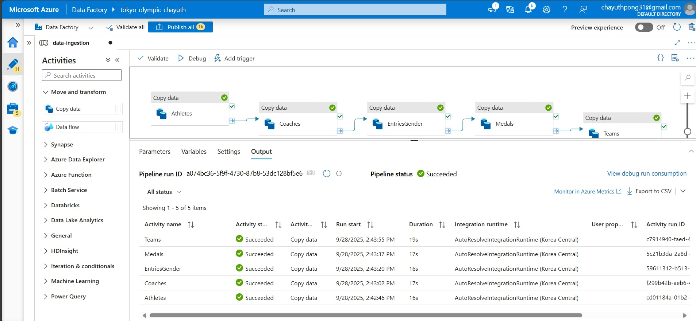
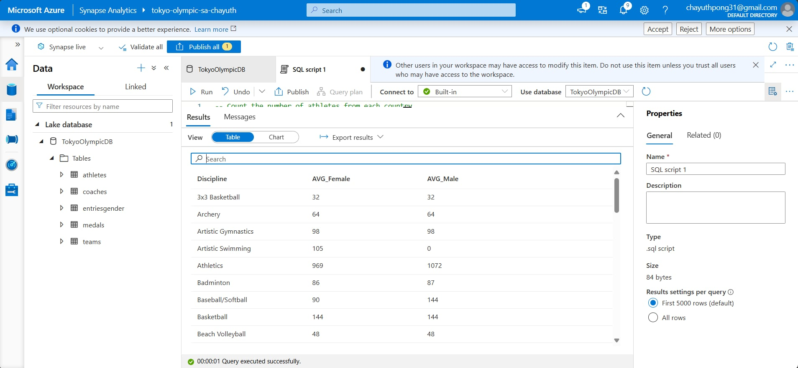

# Olympic-Data-Analytics

## Overview

Developed an end-to-end data engineering pipeline to extract football statistics from Wikipedia. Used Apache Airflow for workflow orchestration, storing raw data in Azure Data Lake. Leveraged Azure Data Factory for data migration and transformation, enabling scalable analysis and querying via Azure Synapse Analytics.

## Table of Contents
- [Overview](#overview)
- [Architecture](#architecture)
- [Dataset Used](#dataset-used)
- [Step in This Project](#step-in-this-project)
- [Results](#results)

## Architecture

### Tech Stacks
Microsoft Azure
1. Data Factory
2. Data Lake Gen2
3. Azure Databricks
4. Azure Synapse Analytics

## Dataset Used
This contains the details of over 11,000 athletes, with 47 disciplines, along with 743 Teams taking part in the 2021(2020) Tokyo Olympics.
This dataset contains the details of the Athletes, Coaches, Teams participating as well as the Entries by gender. It contains their names, countries represented, discipline, gender of competitors, name of the coaches.

More information : https://www.kaggle.com/datasets/arjunprasadsarkhel/2021-olympics-in-tokyo

## Step in This Project
1. Data Ingestion: Create and upload dataset to Azure Data Lake Gen 2 in Raw bucket with Data Factory.
2. Transformation: Connect and load data into Azure Databricks and transform data used pyspark.Then load data into Transformed bucket.
3. Analytics: Connect and load data into Azure Synapse Analytics and create Lake database to perform analytics.

## Results
1. Data Ingestion

2. Run Data Flow

3. Data load to Raw Bucket

4. Transformed and load to Transformed Bucket

5. Connect and Create Lake database

6. Data Analytics
    1. Count the number of athletes from each country
    
    2. Calculate the total medals won by each country
    
    3. Calculate the average number of entries by gender for each discipline
    
